# Active Directory LAB Setup

Domain: evilcorp.lab

---

## Architecture

```
Host Linux (Arch)
192.168.148.1
        |
        |
   VMnet1 (Host-only)
    192.168.148.0/24
------------------------------------------------
|                    |                         |
|                    |                         |
DC                  WIN10-U1                WIN10-A1
Server 2019        Windows 10               Windows 10              
192.168.148.10     192.168.148.20          192.168.148.30
DNS -> self        DNS -> 148.10           DNS -> 148.10
|
|
|
Domain: evilcorp.lab
|
|-- Users
|    |-- john.smith
|    |-- alice.dev
|    |-- bob.hr
|    |-- helpdesk1
|    |-- itadmin
|    |-- svc_backup
|    |-- svc_sql
|    ....Other users
|
|-- Computers
     |-- DC01
     |-- WIN10-U1
     |-- WIN10-A1
```

---

# Configuring IP addresses

- I am using Default VMNet Provided by VMware, 192.168.148.0/24
- The first IP address 192.168.148.1 is used by my linux device

### Configuring DC IP address

- Windows 2019 Server 
- Go to network and Internet Settings > Change adapter Options > Click on the only adapter available (Ethernet 0 in my case)
- Right Click on Ethernet0 > Properties
- Click on Internet Protocol Version 4
- Set the following IP address, Subnet Mask and DNS

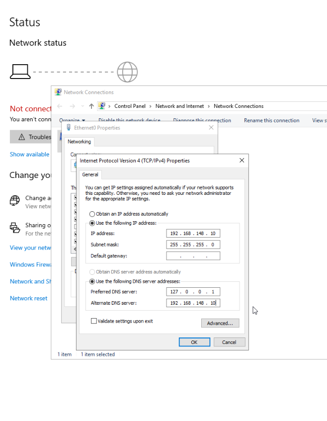


### Configuring Client IP addresses
- Windows 10
- Go to network and Internet Settings > Ethernet > Change Setting to manual > Set Ipv4 to ON > Put IP address
- [IMP]: Make sure to keep the server IP address as the DNS

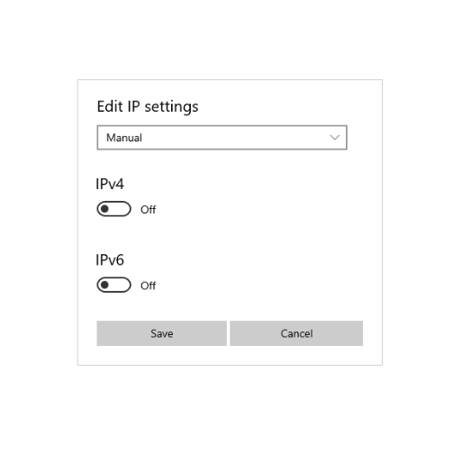
  

For WIN10U1
  
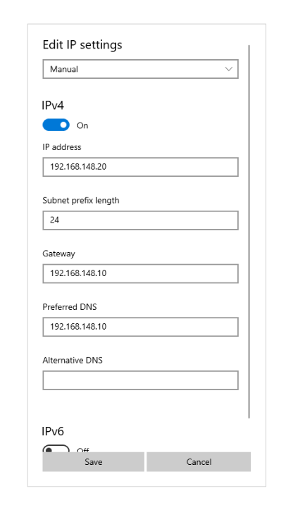


For WIN10A1

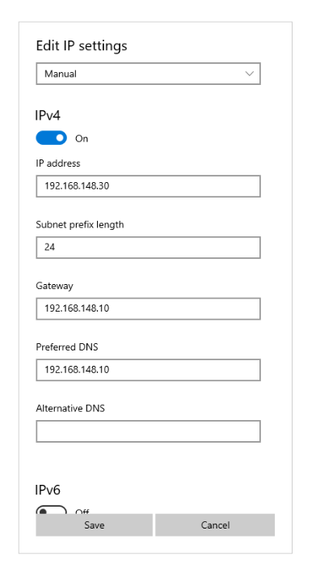

---

# Configuring Names of all Computers

Settings > System > About > Rename this PC

For DC:

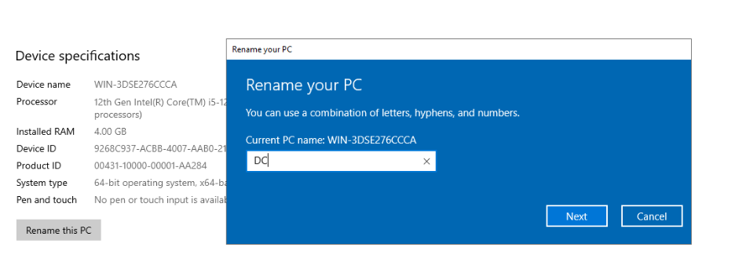

For Client PCs:

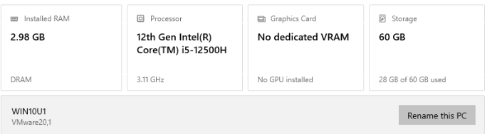

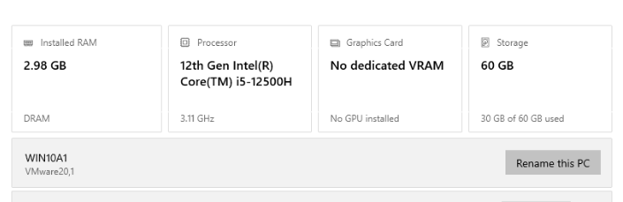

---

# Downloading Active Directory Domain Services

- Server Manager > Add Roles and Features

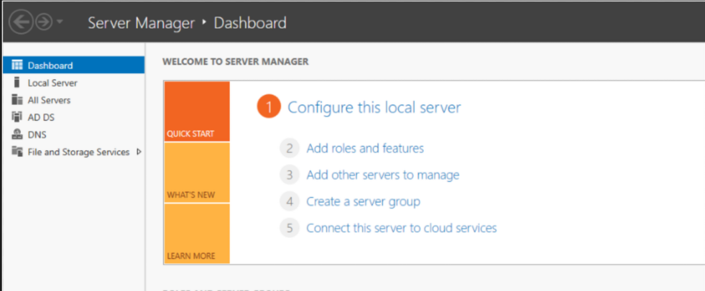

- Select AD Domain Services 
- This installs DNS and AD Domain Services Both

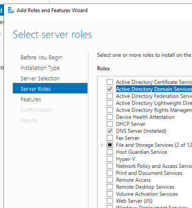

- Install AD Domain Services

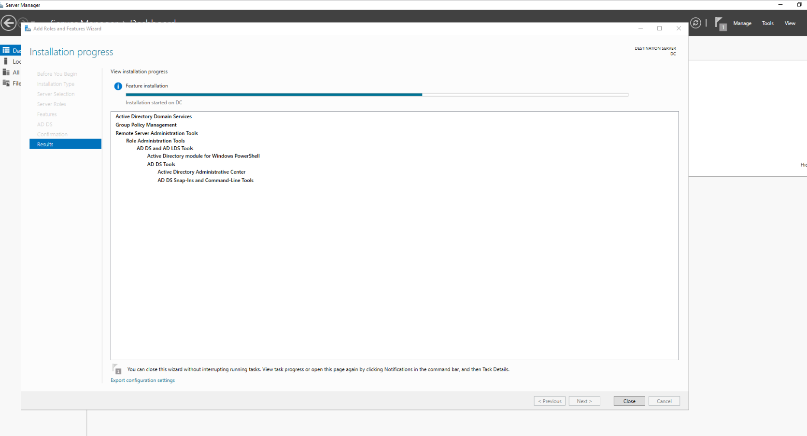

---

# Promoting server to Active Directory

- Go to Server Manager > Notifications > Click 'Promote'

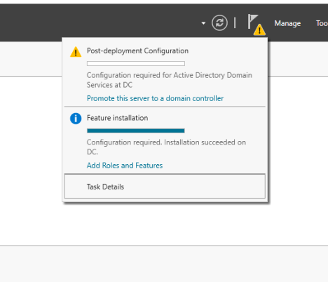

- Add a new forest > Put root domain name 'evilcorp.lab' in my case

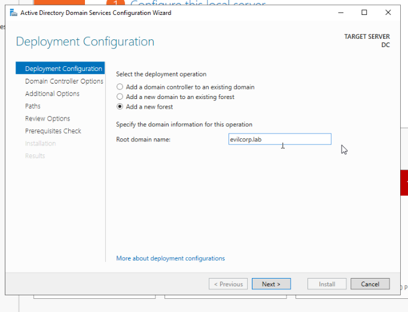

- Set password and Confirm

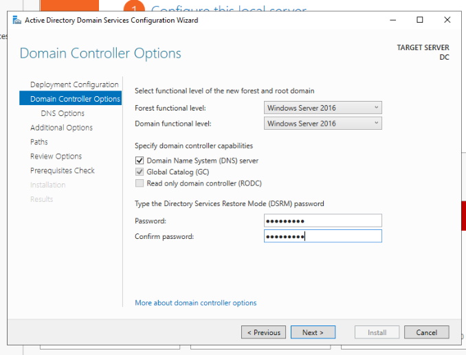

- Install and Restart 

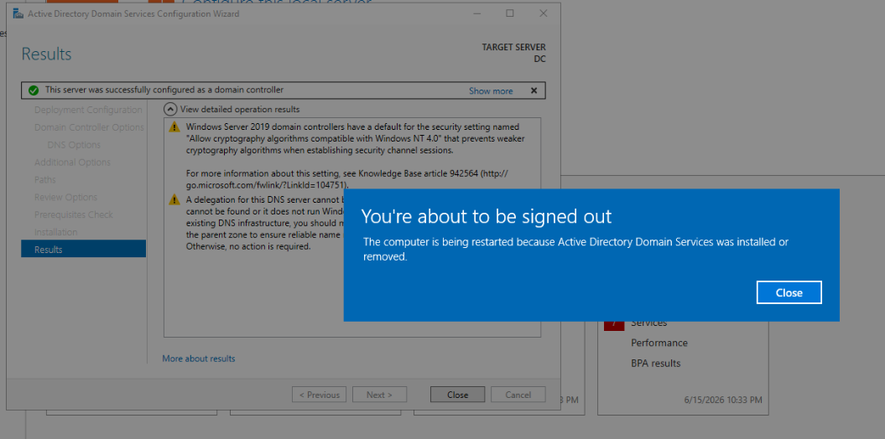

- In the server you can login using the domain now

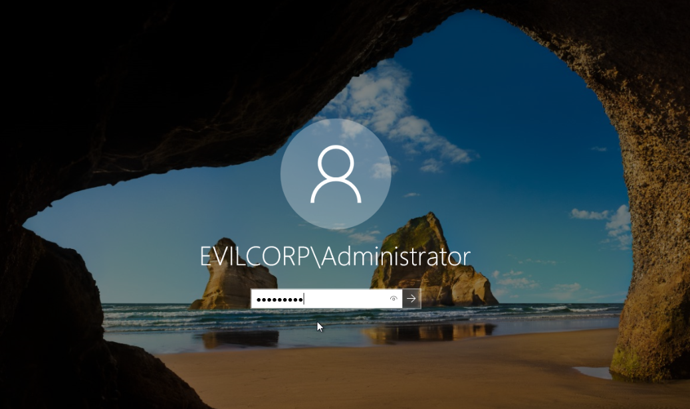

- On Server Manager you can see AD DS and DNS services are up and running

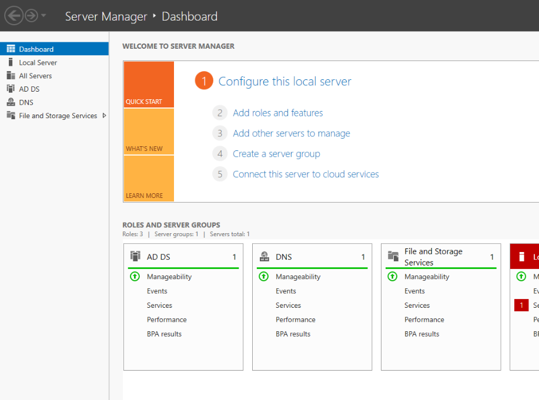

---

# Connect Client Computers to the Active Directory Domain 

In Both the Client Computers: 
- Settings > About > Click on 'Rename this PC (Advanced)' on the far right

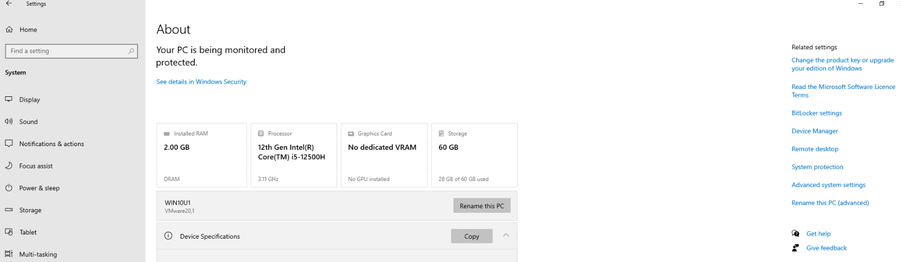

- Click on Change Button, here we are changing the domain of the PC

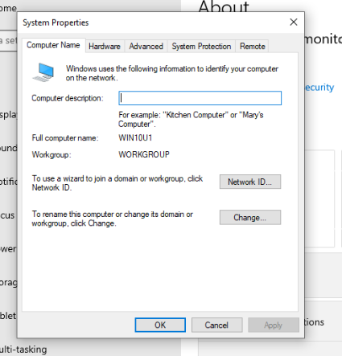

- Add domain 'evilcorp.lab' and click OK

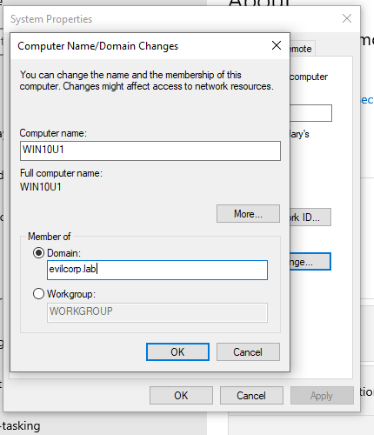

- Authenticate with username and password of the Admin of our domain

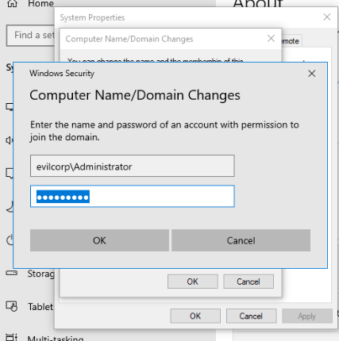

- Congratulations, the computer is now connected to evilcorp.lab domain

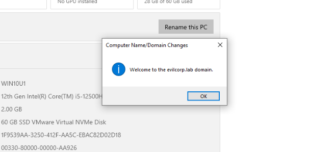

### Verification

I can login to both cliet computers using evilcorp\Administrator 

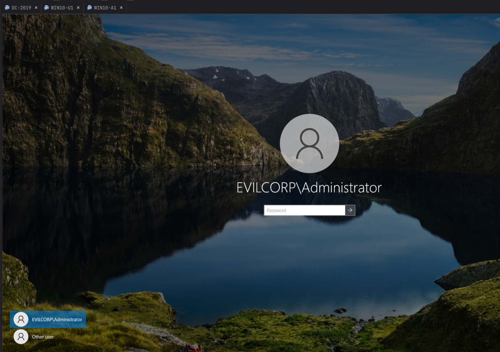

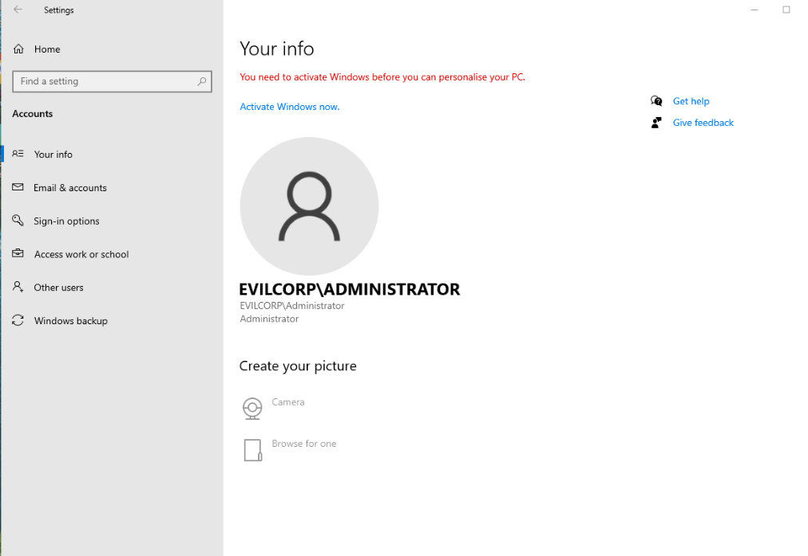

I can also check on Domain Controller Server > 'Active Directory Users and Computers' > Computers 

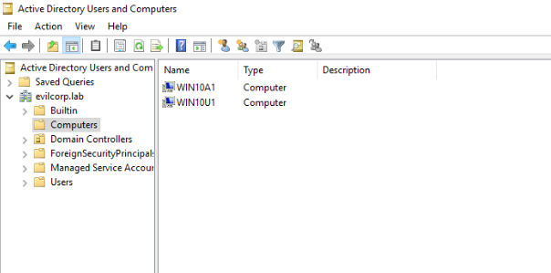

I can see Both my client PCs.