# Active Directory LAB Setup

This repository documents the steps I followed to set up a Windows Active Directory lab on VMware

> Domain: evilcorp.lab

## Index

* [Architecture](#architecture)
* [Configuring IP addresses](#configuring-ip-addresses)
* [Configuring Names of all Computers](#configuring-names-of-all-computers)
* [Downloading Active Directory Domain Services](#downloading-active-directory-domain-services)
* [Promoting server to Active Directory](#promoting-server-to-active-directory)
* [Connect Client Computers to the Active Directory Domain](#connect-client-computers-to-the-active-directory-domain)
* [Adding Users to the Active Directory Domain](#adding-users-to-the-active-directory-domain)
* [Making and deploying Policies](#making-and-deploying-policies)

---

# Architecture

```
Host Linux (Arch)
192.168.148.1
        |
        |
   VMnet1 (Host-only)
    192.168.148.0/24
------------------------------------------------
|                    |                         |
|                    |                         |
DC                  WIN10-U1                WIN10-A1
Server 2019        Windows 10               Windows 10              
192.168.148.10     192.168.148.20          192.168.148.30
DNS -> self        DNS -> 148.10           DNS -> 148.10
|
|
Domain: evilcorp.lab
|
|-- Users
|    |-- john.smith
|    |-- alice.dev
|    |-- bob.hr
|    |-- helpdesk1
|    |-- itadmin
|    |-- svc_backup
|    |-- svc_sql
|    ....Other users
|
|-- Computers
     |-- DC01
     |-- WIN10-U1
     |-- WIN10-A1
```

---

# Configuring IP addresses

- I am using Default VMNet Provided by VMware, 192.168.148.0/24
- The first IP address 192.168.148.1 is used by my linux device

### Configuring DC IP address

- Windows 2019 Server 
- Go to network and Internet Settings > Change adapter Options > Click on the only adapter available (Ethernet 0 in my case)
- Right Click on Ethernet0 > Properties
- Click on Internet Protocol Version 4
- Set the following IP address, Subnet Mask and DNS


### Configuring Client IP addresses
- Windows 10
- Go to network and Internet Settings > Ethernet > Change Setting to manual > Set Ipv4 to ON > Put IP address
- [IMP]: Make sure to keep the server IP address as the DNS


  

For WIN10U1
  


For WIN10A1


---

# Configuring Names of all Computers

Settings > System > About > Rename this PC

For DC:


For Client PCs:


---

# Downloading Active Directory Domain Services

- Server Manager > Add Roles and Features


- Select AD Domain Services 
- This installs DNS and AD Domain Services Both


- Install AD Domain Services


---

# Promoting server to Active Directory

- Go to Server Manager > Notifications > Click 'Promote'


- Add a new forest > Put root domain name 'evilcorp.lab' in my case


- Set password and Confirm


- Install and Restart 


- In the server you can login using the domain now


- On Server Manager you can see AD DS and DNS services are up and running


---

# Connect Client Computers to the Active Directory Domain 

In Both the Client Computers: 
- Settings > About > Click on 'Rename this PC (Advanced)' on the far right


- Click on Change Button, here we are changing the domain of the PC


- Add domain 'evilcorp.lab' and click OK


- Authenticate with username and password of the Admin of our domain


- Congratulations, the computer is now connected to evilcorp.lab domain


- Repeat the same for other computer too

### Verification

I can login to both cliet computers using evilcorp\Administrator 


I can also check on Domain Controller Server > 'Active Directory Users and Computers' > Computers 


I can see Both my client PCs.

---

# Adding Users to the Active Directory Domain

I will have 12 users in this lab

Regular Employees(OU = Dev, HR, Finance, Marketing): 

| Name          | Username      | Department |
| ------------- | ------------- | ---------- |
| Emma Brown    | emma.brown    | Dev        |
| Kevin White   | kevin.white   | Dev        |
| Bob Miller    | bob.miller    | HR         |
| Daniel Clark  | daniel.clark  | HR         |
| Sarah Lee     | sarah.lee     | Finance    |
| Mia Walker    | mia.walker    | Finance    |
| John Smith    | john.smith    | Marketing  |
| Ethan Hall    | ethan.hall    | Marketing  |

Admin Users(OU = IT):

| Name         | Username    |
| ------------ | ----------- |
| Helpdesk     | helpdesk    |
| IT Admin     | itadmin     |

Service Accounts(OU = Services):

| Name            | Username    |
| --------------- | ----------- |
| SQL Service     | svc_sql     |
| Backup Service  | svc_backup  |

### Adding users

- Go to 'Active Directory Users and Computers' > evilcorp.lab > Right click > Create a New Organizational Unit
- Name it 'EVILCORP'

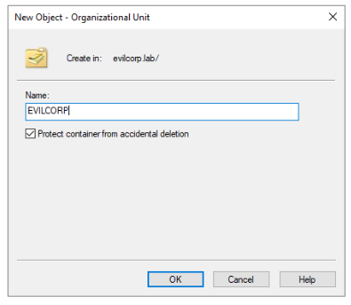


- Go to EVILCORP OU
- Right Click > Create new User
- Fill in details, repeat for all other users

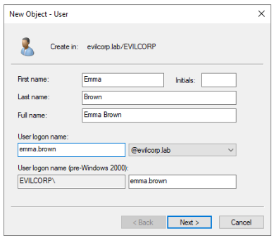

- Just for the lab I will keep a simple password, and set Password never expires option

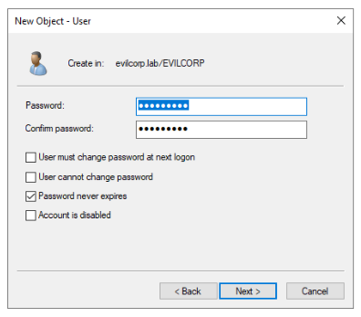

- Once I add all the users and divide them in OUs, this is how the structure looks like:

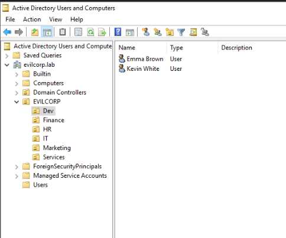

### Verifying

I try signing into a client computer using credentials of Daniel Clark

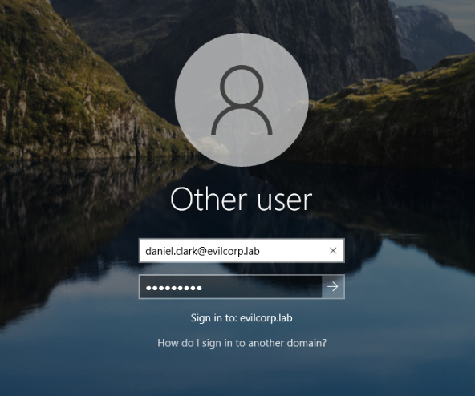

I can sign in

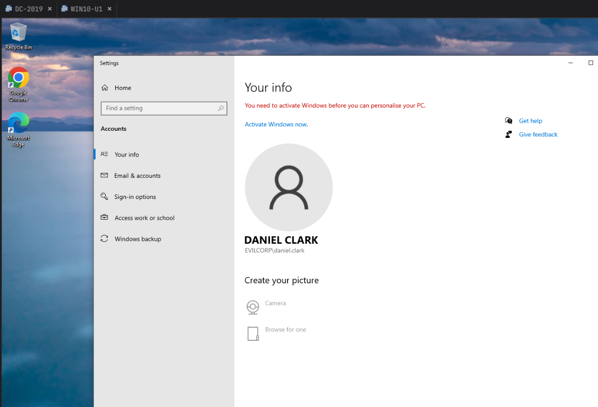

---

# Making and deploying Policies

- For this, I will block the control panel access to all users of HR, Finance and Marketing

- Go to 'Group Policy Management' software on DC Server
- Go to Group Policy Objects

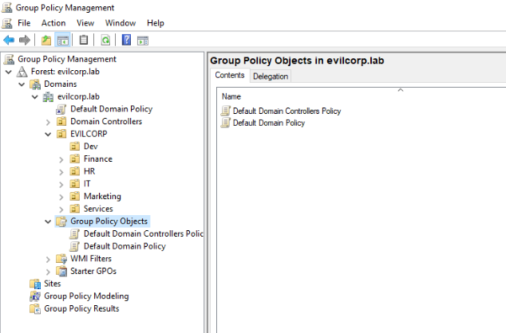

- Right Click > New 
- Make New group Policy Object
- Calling it 'Contol Panel Access Block'

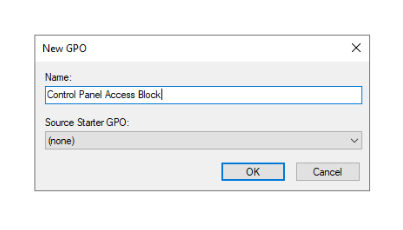

- On the newly created GPO > Right Click > Edit
- Go to Control Panel under User Configuration

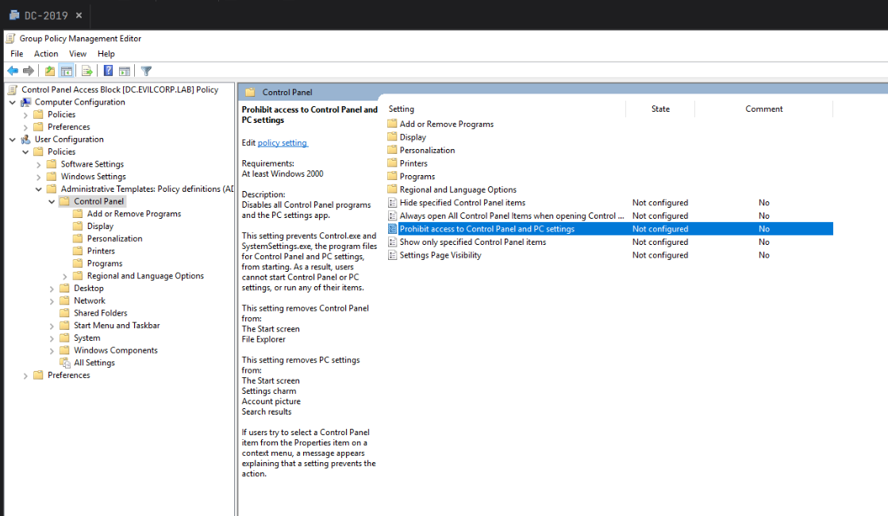

- Right click on 'Prohibit Access to Control Panel and PC Settings'
- Set to enabled and Click on Apply

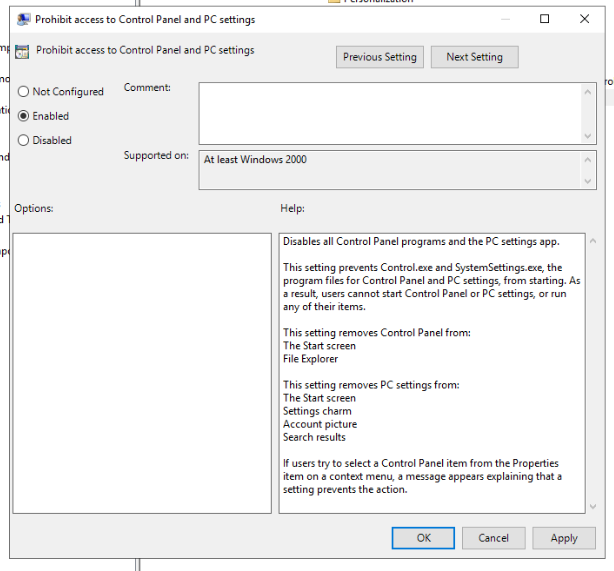

- Close the window > Head back to Group Policy Objects
- Click on the settings tab, you can see summary of the rule applied

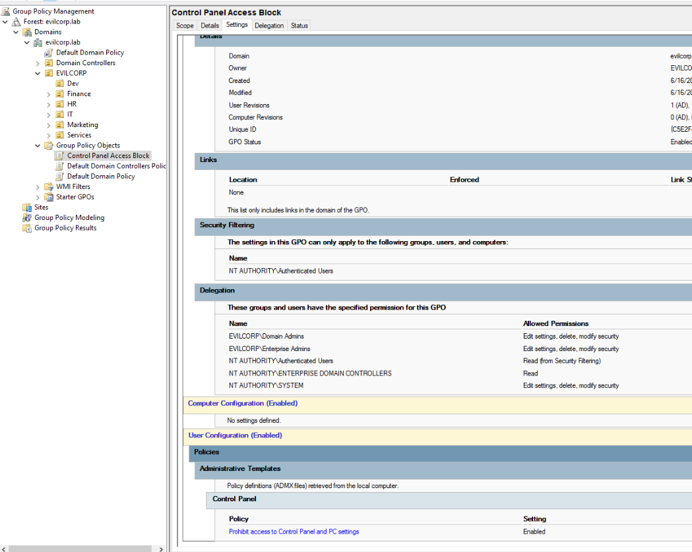

- Drag and drop GPO to the desired OUs

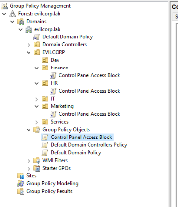

### Verifying

- I login to Daniel Clark's account (who is in HR department) and start Control Panel from a client PC

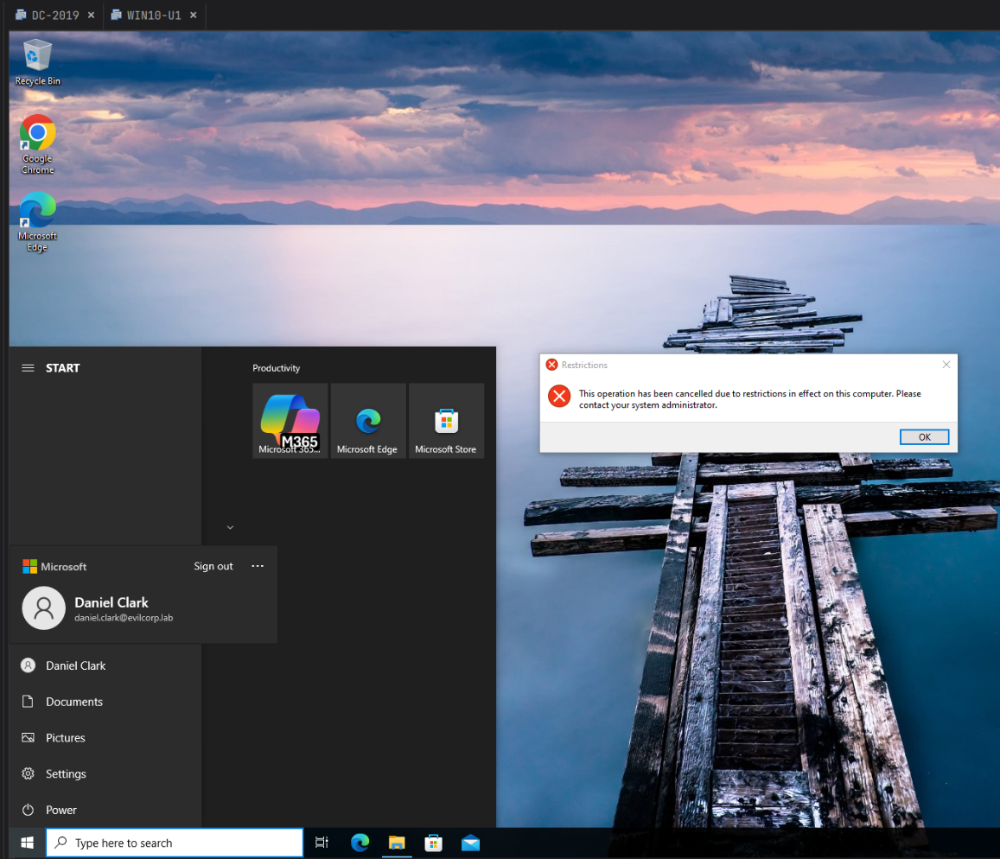

As you can see, I cannot start Control Panel.

---

Next Steps:
I will be exploiting Active Directory, will create another repository or add in this repository.  
Thank you.
